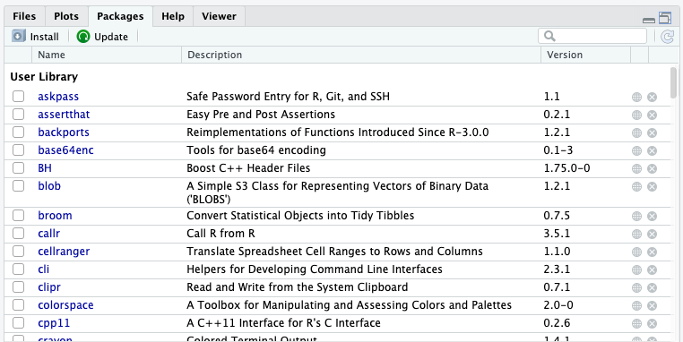

---
# Please do not edit this file directly; it is auto generated.
# Instead, please edit 06-Bioconductor.md in _episodes_rmd/
title: Installing Packages and Bioconductor Overview
teaching: 20
exercises: 5
questions:
- "What is CRAN?"
- "How do I install packages?"
- "What is Bioconductor?"
- "How do I install Bioconductor packages?"
- "How do I find help in Bioconductor?"
objectives:
- "Manage packages"
- "Manage Bioconductor Packages"
- "Navigate Bioconductor"
- "Gain access to Bioconductor"
- "Learn about packages to access data"
- "Other output formats"
keypoints:
- "Both CRAN and Bioconductor provide a pantheon of packages to extend R."
- "Use `install.packages()` to install packages (libraries)."
- "`BiocManager::install()` is the recommended way to install Bioconductor packages."
source: Rmd
---

## R Packages and CRAN

It is possible to add functions to R by writing a package, or by
obtaining a package written by someone else. As of this writing, there
are over [17,000 packages](https://cran.r-project.org/web/packages/) available on CRAN (the comprehensive R archive
network). R and RStudio provide functionality for managing packages:

### From the console:

* You can see what packages are installed by typing
  `installed.packages()`
* You can install packages by typing `install.packages("packagename")`,
  where `packagename` is the package name, in quotes.
* You can update installed packages by typing `update.packages()`
* You can remove a package with `remove.packages("packagename")`
* You can make a package available for use with `library(packagename)`

### Using the RStudio interface

You can also use the RStudio interface to view and install packages. `Pane 4` (which might be different for you if you've personalized RStudio's interface) provides a `Packages` tab that allows you to see the packages you have installed in your `User Library`, these are the packages you have installed throughout your R use experience, and also the `System Library` the packages that are part of the R kernal which is updated when you update your version of R.  

The default packages interface for RStudio: 

## About Biocondutor

Bioconductor provides tools for the analysis and comprehension of high-throughput genomic data. Bioconductor uses the R statistical programming language, and is open source and open development. It has two releases each year, and an active user community. 
