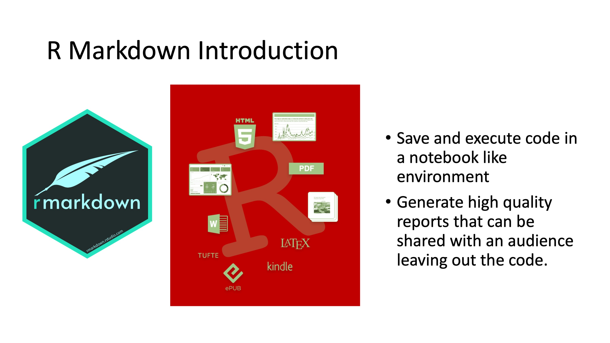
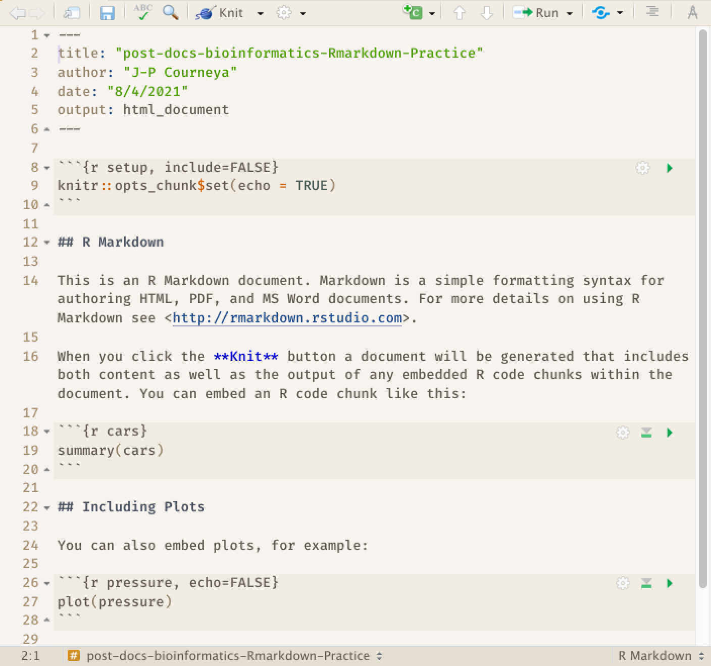
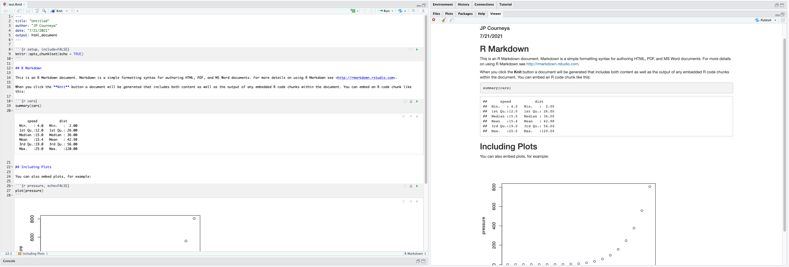
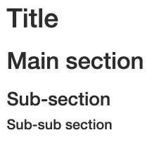

```{r chunk_options, include=FALSE}
source("../bin/chunk-options.R")
knitr_fig_path("06-")
```

## Reproducible Reports with R Markdown

It doesn't matter how great your analysis is unless you can explain it to others and provide your analysis in a way that is reproducibly by others: you need to **communicate** your results.

Many new users begin by first writing a single R script containing all of their work, and then share the analysis by emailing the script and various graphs as attachments. But this can be cumbersome, requiring a lengthy discussion to explain which attachment was which result.

Writing formal reports with Word can simplify this process by incorporating both the analysis report and output graphs into a single document. But tweaking formatting to make figures look correct and fixing obnoxious page breaks can be tedious and lead to a lengthy "whack-a-mole" game of fixing new mistakes resulting from a single formatting change.

## What is R Markdown

```{r echo=F, out.width = '80%', fig.align="center"}
library(knitr)

```

R Markdown provides an authoring framework for data science. You can use a single R Markdown file to both

-   save and execute code, and

-   generate high quality reports that can be shared with an audience.

R Markdown was designed for easier reproducibility, since both the computing code and narratives are in the same document, and results are automatically generated from the source code. R Markdown supports dozens of static and dynamic/interactive output formats like word, pdf, powerpoint and more!

To use Rmarkdown you need the `rmarkdown` package, but you don't need to explicitly install it or load it, as RStudio automatically does both when needed.

## R Markdown Related Packages

```{r echo=F, out.width = '80%', fig.align="center"}
library(knitr)

```

In addition to the amazing reports and even slide decks that you can produce with Rmarkdown one of the other amazing features is that it can also be used to create your own website using the package blogdown and author books using the bookdown package. These two abilities truly extend the reach of your work essentially making it available to anyone with a web browser and internet connection.

`bookdown` is an R package that allows you to write books and long-form reports with multiple Rmd files. After this package was published, a large number of books have emerged. You can find a subset of them at (<https://bookdown.org>). Some of these books have been printed, and some only have free online versions.

There have also been students who wrote their dissertations/theses with bookdown, such as Ed Berry: (<https://eddjberry.netlify.com/post/writing-your-thesis-with-bookdown/>). Chester Ismay has even provided an R package thesisdown (<https://github.com/ismayc/thesisdown>) that can render a thesis in various formats.

The `blogdown` package can be used to build general-purpose websites (including blogs and personal websites) based on R Markdown. You may find tons of examples at (<https://github.com/rbind>) or by searching on Twitter: (<https://twitter.com/search?q=blogdown>).

## How does R Markdown work

Lets take a look under the hood at R Markdown. The best way to get a sense of whats going on is to create a R Markdown file using RStudio.

### Creating an R Markdown file

Within RStudio, click File → New File → R Markdown and you'll get a dialog box like this:

```{r echo=F, out.width = '80%', fig.align="center"}

```

You can stick with the default (HTML output), but give it a title.

As a result RStudio generates this:

```{r echo=F, out.width = '80%', fig.align="center"}

```

### R Markdown Basic Components

What we see is an R Markdown file, a plain text file that has the extension `.Rmd`: It contains three important types of content:

1.  An (optional) **YAML header** surrounded by `---`s.
2.  **Chunks** of R code surrounded by ```` ``` ````.
3.  Text mixed with simple text formatting like `# heading` and `_italics_`.

#### YAML Header

The initial chunk of text (header) contains instructions for R to specify what kind of document will be created, and the options chosen. You can use the header to give your document a title, author, date, and tell it what type of output you want to produce. In this case, we're creating an html document. The syntax for the metadata is YAML (YAML Ain't Markup Language, (<https://en.wikipedia.org/wiki/YAML>)), so sometimes it is also called the YAML metadata or the YAML frontmatter. Before it bites you hard, we want to warn you in advance that indentation matters in YAML, so do not forget to indent the sub-fields of a top field properly.

```{r eval=FALSE}
---
title: "post-docs-bioinformatics-Rmd-Practice"
author: "JP Courneya"
date: "7/21/2021"
output: html_document
---
```

#### Body of the document

The body of the document follows the metadata. The syntax for text (also known as prose or narratives) is Markdown, a lightweight set of conventions for formatting plain text files. Markdown is designed to be easy to read and easy to write. There are also two types of computer code, code chunks and inline R code. We will look at each of these in more detail in subsequent sections.

You will notice in the `.Rmd` interface the code and output are interleaved. You can run each code chunk by clicking the Run icon (it looks like a play button at the top of the chunk), or by pressing <KBD>Cmd/Ctrl</KBD>+<KBD>Shift</KBD>+<KBD>Enter</KBD>. RStudio executes the code and displays the results inline with the code:

```{r echo=F, out.width = '100%', fig.align="center"}

```

To generate a report from the file, run the `render` command:

```{r eval=FALSE}
library(rmarkdown)
render("post-docs-bioinformatics-rmd-practice.Rmd")
```

Better still, use the: button in the RStudio IDE to render the file and preview the output with a single click. You will notice your first time "knitting" the document you are prompted to save the file, save it with a meaningful name.

```{r echo=F, out.width = '100%', fig.align="left"}

```

R Markdown generates a new file that contains selected text, code, and results from the .Rmd file.

#### How things get compiled

```{r echo=F, out.width = '50%', fig.align="center"}
knitr::include_graphics("../fig/rmarkdownflow.png")
```

When you run `render`, or press the <KBD>Knit</KBD> button, R Markdown feeds the .Rmd file to knitr, which executes all of the code chunks and creates a new markdown (.md) document which includes the code and its output.

The markdown file generated by knitr is then processed by pandoc which is responsible for creating the finished format.

This may sound complicated, but R Markdown makes it extremely simple by encapsulating all of the above processing into a single `render` function or <KBD>Knit</KBD> button.

### Markdown

Markdown is a system for writing web pages by marking up the text much as you would in an email rather than writing html code. The marked-up text gets converted to html, replacing the marks with the proper html code.

For now, let’s delete all of the stuff that’s in the `.Rmd` file and write a bit of markdown.

You make things bold using two asterisks, like this: ````**bold**````, and you make things italics by using underscores, like this: ````_italics_````.

You can make a bulleted list by writing a list with hyphens or asterisks, like this:

```markdown
* one item
* one item
* one item
    * one more item
    * one more item
    * one more item
    
- bold with double-asterisks
- italics with underscores
- code-type font with backticks
```

The output is:

* one item
* one item
* one item
    * one more item
    * one more item
    * one more item

- bold with double-asterisks
- italics with underscores
- code-type font with backticks

You can use whatever method you prefer, but be consistent. This maintains the readability of your code.

You can make a numbered list by just using numbers. You can even use the same number over and over if you want:

```markdown
1. bold with double-asterisks
1. italics with underscores
1. code-type font with backticks
```
This will appear as:

1. bold with double-asterisks
1. italics with underscores
1. code-type font with backticks

You can make section headers of different sizes by initiating a line with some number of `#` symbols:

```markdown
# Title
## Main section
### Sub-section
#### Sub-sub section
```
They will appear like this:

```{r echo=F, out.width = '30%', fig.align="left"}

```

#### A bit more Markdown

You can make a hyperlink like this: `[text to show](http://the-web-page.com)`.

You can include an image file like this: ``

You can do subscripts (e.g., F~2~) with `F~2~` and superscripts (e.g., F^2^) with `F^2^`.

If you know how to write equations in LaTeX, you can use `$ $` and `$$ $$` to insert math equations, like `$E = mc^2$` and

```markdown
$$y = \mu + \sum_{i=1}^p \beta_i x_i + \epsilon$$
```
### R code chunks

The real power of Markdown comes from mixing markdown with chunks of code. This is R Markdown. When processed, the R code will be executed; if they produce figures, the figures will be inserted in the final document.

To run code inside an R Markdown document, you need to insert a chunk.
There are three ways to do so:

1.  The keyboard shortcut <KBD>Cmd/Ctrl</KBD>+<KBD>Alt</KBD>+<KBD>I</KBD>

2.  The "Insert" button icon in the editor toolbar.

3.  By manually typing the chunk delimiters ```` ```{r} ```` and ```` ``` ````. 

I'd recommend you learn the keyboard shortcut. It will save you a lot of time in the long run!

The main code chunks look like this:

````
```{r}`r ''`
    summary(cars)
```
````

You should give each chunk a unique name, as they will help you to fix errors and, if any graphs are produced, the file names are based on the name of the code chunk that produced them.

> ## Exercise: Add code chunks to your R Markdown Document:
>
>A) Download the gapminder data from [here](https://raw.githubusercontent.com/resbaz/r-novice-gapminder-files/master/data/gapminder-FiveYearData.csv). 
> 1. Download the file (CTRL + S, right mouse click -> "Save as", or File -> "Save page as")
> 2. Make sure it's saved under the name `gapminder-FiveYearData.csv`
> 3. Save the file in the `data/` folder within your project.
>
>B) Load the `ggplot2` package
>
>C) Read the gapminder data to an object named `gapminder`
>
>D) Create a plot of `lifeExp ~ year`
>
>> ## Solution
>>
>>````
>>```{r download-gapminder-data, eval=TRUE}`r ''`
>>download.file("https://raw.githubusercontent.com/resbaz/r-novice-gapminder-files/master/data/gapminder-FiveYearData.csv", destfile = >>"data/gapminder-FiveYearData.csv")
>>```
>>
>>```{r load-ggplot2, eval=TRUE}`r ''`
>>library("ggplot2")
>>```
>>
>>```{r read-gapminder-data, eval=TRUE}`r ''`
>>gapminder <- read.csv(file = "data/gapminder_data.csv", stringsAsFactors = >>TRUE)
>>```
>>
>>```{r make-plot, eval=TRUE}`r ''`
>>plot(lifeExp ~ year, data = gapminder)
>>```
>>````
> {: .solution}
{: .challenge}

#### Chunk Options

There are a variety of options to affect how the code chunks are treated. Here are some examples:

* Use `echo=FALSE` to avoid having the code itself shown.
* Use `results="hide"` to avoid having any results printed.
* Use `eval=FALSE` to have the code shown but not evaluated.
* Use `warning=FALSE` and `message=FALSE` to hide any warnings or messages produced.
* Use `fig.height` and `fig.width` to control the size of the figures produced (in inches).

So you might write:

````
```{r load_libraries, echo=FALSE, message=FALSE}`r ''`
library("dplyr")
library("ggplot2")
```
````

Often there will be particular options that you’ll want to use repeatedly; for this, you can set _global_ chunk options, like so:

````
```{r global_options, echo=FALSE}`r ''`
knitr::opts_chunk$set(fig.path="Figs/", message=FALSE, warning=FALSE, echo=FALSE, results="hide", fig.width=11)
```
````
The `fig.path` option defines where the figures will be saved. The `/` here is really important; without it, the figures would be saved in the standard place but just with names that begin with `Figs`.

If you have multiple R Markdown files in a common directory, you might want to use fig.path to define separate prefixes for the figure file names, like `fig.path="Figs/cleaning-"` and `fig.path="Figs/analysis-"`.
You can review all of the `R` chunk options by navigating to the “R Markdown Cheat Sheet” under the “Cheatsheets” section of the “Help” field in the toolbar at the top of RStudio.

#### Inline code

There is one other way to embed R code into an R Markdown document: directly into the text, with: `````r `````.
This can be very useful if you mention properties of your data in the text.
For example, using the `diamonds` dataset we could report:

> We have data about  `r inline_expr('nrow(ggplot2::diamonds')`  diamonds.

The output would be: 

> We have data about `r nrow(ggplot2::diamonds)` diamonds.

When inserting numbers into text, `format()` is your friend.
It allows you to set the number of `digits` so you don't print to a ridiculous degree of accuracy, and a `big.mark` to make numbers easier to read.
The expression:

>We have data about `` `r inline_expr('format(nrow(ggplot2::diamonds), digits = 2, big.mark = ",")')` `` diamonds.

Would look like this:

>We have data about `r format(nrow(ggplot2::diamonds), digits = 2, big.mark = ",")` diamonds.

You can combine these into a helper function:

```{r}
comma <- function(x) format(x, digits = 2, big.mark = ",")
comma(3452345)
comma(.12358124331)
```

Using our nifty helper function,

The expression will now look different `` `r inline_expr('comma(nrow(ggplot2::diamonds))')` ``

But give us the same amazing results as `` `r inline_expr('format(nrow(ggplot2::diamonds), digits = 2, big.mark = ",")')` `` !

>We have data about `r comma(nrow(ggplot2::diamonds))` diamonds.

## Resources for R Markdown

* [Knitr in a knutshell tutorial](http://kbroman.org/knitr_knutshell)
* [Dynamic Documents with R and knitr](http://www.amazon.com/exec/obidos/ASIN/1482203537/7210-20) (book)
* [R Markdown documentation](http://rmarkdown.rstudio.com)
* [R Markdown cheat sheet](https://www.rstudio.com/wp-content/uploads/2016/03/rmarkdown-cheatsheet-2.0.pdf)
* [Getting started with R Markdown](https://www.rstudio.com/resources/webinars/getting-started-with-r-markdown/)
* [R Markdown: The Definitive Guide](https://bookdown.org/yihui/rmarkdown/) (book by Rstudio team)
* [Reproducible Reporting](https://www.rstudio.com/resources/webinars/reproducible-reporting/)
* [The Ecosystem of R Markdown](https://www.rstudio.com/resources/webinars/the-ecosystem-of-r-markdown/)
* [Introducing Bookdown](https://www.rstudio.com/resources/webinars/introducing-bookdown/)