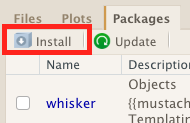
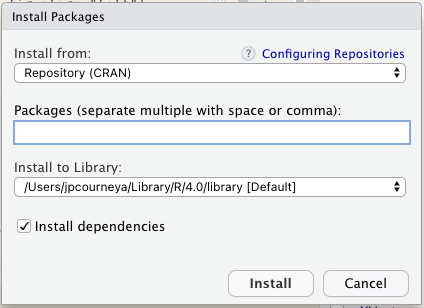
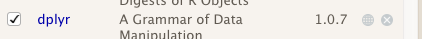

```{r chunk_options, include=FALSE}
source("../bin/chunk-options.R")
knitr_fig_path("07-")
```

## R Packages and CRAN

It is possible to add functions to R by writing a package, or by
obtaining a package written by someone else. One of the primary ways in which packages are distributed is through centralized repositories. The first R repository a user typically runs into is the [Comprehensive R Archive Network](https://cran.r-project.org/mirrors.html) (CRAN), As of this writing, there are over [17,000 packages](https://cran.r-project.org/web/packages/) available on CRAN, the home of many of the most popular R packages. R and RStudio provide functionality for managing packages:

### From the console:

* You can see what packages are installed by typing
  `installed.packages()`
* You can install packages by typing `install.packages("packagename")`,
  where `packagename` is the package name, in quotes.
* You can update installed packages by typing `update.packages()`
* You can remove a package with `remove.packages("packagename")`
* You can make a package available for use with `library(packagename)`

### Using the RStudio interface

You can also use the RStudio interface to view and install packages. `Pane 4` (which might be different for you if you've personalized RStudio's interface) provides a `Packages` tab that allows you to see the packages you have installed and loaded at a given point in time. The `Packages` tab is broken down into your `User Library`, these are the packages you have installed throughout your R use experience, and also the `System Library` the packages that are part of the R kernel which is updated when you update your version of R.  

The default packages interface for RStudio: 

```{r echo=F, out.width = '60%', fig.align="left"}
knitr::include_graphics("../fig/rstudio_packages.png")
```


To install a package click <KBD>Install</KBD> 


```{r echo=F, out.width = '30%', fig.align="left"}

```


In the pop-up window type the package name of interest. 


```{r echo=F, out.width = '30%', fig.align="left"}

```

### Loading Packages

When it comes time to load a package you have installed it can also be done a number of ways most commonly it will be done using the console or writing it at the beginning of a script since the first thing you should be doing in your script is loading libraries. 

**From the console:**
```{r loadLib, eval=FALSE, echo=TRUE, purl=FALSE}
library(<package>)
```

**Using the RStudio interface:** 
```{r echo=F, out.width = '60%', fig.align="left"}

```
Click the white box next to a package in your library and that will load the library in to your session. 

> ## Tip: Beware of loading conflicts
>Pay attention to the messages that are being printed to the console when you load a package. Sometimes you will see `The following objects are masked from...`. This is telling you that when the package is loaded the function that typically is related to another package is now being referenced by the package you loaded. 
>Sometimes this can cause a conflict between other packages which depend on the native function being masked and cause your code to break. Beware! 
>
{: .callout}

> ## Exercise: Install and Load a package from CRAN
>
>Using both the console and the RStudio interface install and load the `ggplot2` package with the console and `dplyr` package with the RStudio interface. 
>> ## Solution
>>
>>From the console: 
>>```{r loadlib, eval=FALSE, echo=TRUE, purl = FALSE}
>>install.packages("ggplot2") #installs ggplot2
>>library(ggplot2) #loads the package
>>```
>>
>>Using the RStudio interface:
>>
>>Using the `Packages` tab in `Pane 4` click on <KBD>Install</KBD> button and type in `dplyr`. Next proceed to click the <KBD>Check Box</KBD> next to `dplyr` to load it.
> {: .solution}
{: .challenge}

## About Biocondutor

Similar to CRAN, [Bioconductor](https://bioconductor.org/) is a repository of R packages as well. Bioconductor provides tools for the analysis and comprehension of high-throughput genomic data. Bioconductor uses the R statistical programming language, and is open source and open development. It has two releases each year, and an active user community. 

### Installing Bioconductor 

In order to install Bioconductor packages you first need the BiocManager package which is hosted on CRAN. To install it you will need to run: 
```{r installBiocManager, eval=FALSE, echo=TRUE, purl=FALSE}
install.packages("BiocManager")
```

## Bioconductor releases and current version

The Bioconductor project produces two releases each year, one around April and another one around October.

The April release of Bioconductor coincides with the annual release of R.
Packages in that Bioconductor release are tested for the upcoming version of R.
Users must install the new version of R to access the new version of those packages.

The October release of Bioconductor continue to work with the same version of R for that annual cycle.

Each time a new release is made, the minor version of all the packages in the Bioconductor repository is incremented by one.

Once the `r BiocStyle::Biocpkg("BiocManager")` package is installed, the `BiocManager::version()` function displays the version (i.e., release) of the Bioconductor project that is currently active in the R session.

```{r, message=FALSE}
BiocManager::version()
```


## Installing Bioconductor packages

The `BiocManager::install()` function is used to install packages.
The function first searches for the requested package(s) on the Bioconductor repository, but falls back on the CRAN repository and also supports installation from GitHub repositories. There is a lengthy explanation by Bioconductor maintainers as to why using this is prefered over `install.packages()`. Find that [here](https://bioconductor.org/install/#why-biocmanagerinstall)

We can install the `BiocPkgTools` package which provides a collection of simple tools for learning about Bioc Packages we'd install it as so:

```{r, eval=FALSE}
BiocManager::install("BiocPkgTools")
```


# Explore the package universe

```{r, eval=FALSE, message=FALSE}
library(BiocPkgTools) #loads BiocPkgTools 
biocExplore() #interactive  visualization of package info.
```

## Check for updates

The `BiocManager::valid()` function checks the version of currently installed packages, and checks whether a new version is available for any of them on the Bioconductor repository.

Conveniently, if any package can be updated, the function generates and displays the command needed to update those packages.
Users simply need to copy-paste and run that command in their R console.

If everything is up-to-date, the function will simply print `TRUE`.

```{r, eval=FALSE, purl=FALSE}
BiocManager::valid()
```

## Bioconductor Help

Bioconductor stands apart from CRAN in that it requires packages to have documentation available and workflows. Bioconductor also provides a Bioconductor specific [support site](https://support.bioconductor.org/) that is a Stack Overflow type experience. The site is possible due to the contribution of developers in the Bioconductor community as well as countless dedicated volunteers answering questions. 

## Bioconductor Packages

Each package hosted on Bioconductor has a dedicated page with various resources. For an example, looking at the `r BiocStyle::Biocpkg("scater")` package page on Bioconductor, we see that it contains:

- a brief description of the package at the top, in addition to the authors, maintainer, and an associated citation

- installation instructions that can be cut and paste into your R console

- documentation - vignettes, reference manual, news

You can gain the most traction using a package by looking at its  documentation section. 

- Each Bioconductor package contains at least one vignette, a document that provides a task-oriented description of package functionality. Vignettes contain executable examples and are intended to be used interactively.

- The reference manual contains a comprehensive listing of all the functions available in the package. This is a compilation of each function’s manual, aka help pages, which can be accessed programmatically in the R console via ?<function>.

- Finally, the NEWS file contains notes from the authors which highlight changes across different versions of the package. This is a great way of tracking changes, especially functions that are added, removed, or deprecated, in order to keep your scripts current with new versions of dependent packages.

Below this, the Details section covers finer nuances of the package, mostly relating to its relationship to other packages:

- upstream dependencies (_Depends, Imports, Suggests fields_): packages that are imported upon loading the given package

- downstream dependencies (_Depends On Me, Imports Me, Suggests Me_): packages that import the given package when loaded

For example, we can see that an entry called [simpleSingle](https://bioconductor.org/packages/release/workflows/html/simpleSingleCell.html) in the Suggests Me field on the `r BiocStyle::Biocpkg("scater")` page takes us to a step-by-step workflow for low-level analysis of single-cell RNA-seq data.

## BiocViews

One additional Details entry, the [biocViews](https://bioconductor.org/packages/release/BiocViews.html), is helpful for looking at how the authors annotate their package. For example, for the `r BiocStyle::Biocpkg("scater")` package, we see that it is associated with DataImport, DimensionReduction, GeneExpression, RNASeq, and SingleCell, to name but some of its many annotations. 

The BiocViews page provides a hierarchically organized view of annotations associated with Bioconductor packages. Under the [“Software”](https://bioconductor.org/packages/release/BiocViews.html#___Software) label for example (which is comprised of most of the Bioconductor packages), there exist many different views to explore packages. For example, we can inspect based on the associated [“Technology”](https://bioconductor.org/packages/release/BiocViews.html#___Technology), and explore [“Sequencing”](https://bioconductor.org/packages/release/BiocViews.html#___Sequencing) associated packages, and furthermore subset based on [“RNASeq”](https://bioconductor.org/packages/release/BiocViews.html#___RNASeq).

Another area of particular interest is the [“Workflow”](https://bioconductor.org/packages/release/BiocViews.html#___Workflow) view, which provides Bioconductor packages that illustrate an analytical workflow. For example, the [“SingleCellWorkflow”](https://bioconductor.org/packages/release/BiocViews.html#___SingleCellWorkflow) contains the aforementioned tutorial, encapsulated in the simpleSingleCell package.

## Accessing Publicly Available Data

The NCBI Gene Expression Omnibus (GEO) is a public repository of microarray data. Given the rich and varied nature of this resource, it is only natural to want to apply BioConductor tools to these data. GEOquery is the bridge between GEO and BioConductor.

Getting data from GEO is really quite easy. There is only one command that is needed, `getGEO`. This one function interprets its input to determine how to get the data from GEO and then parse the data into useful R data structures. Usage is quite simple. After installing GEOquery `BiocManager::install("GEOquery")`, loads the GEOquery library:

```{r loadGEOquery, eval=FALSE, echo=TRUE, purl=FALSE}
library(GEOquery)
```

Now, you are free to access any GEO accession. In general, you will use only the GEO accession.

```{r getGEO, eval=FALSE, echo=TRUE, purl=FALSE}
gds <- getGEO("GDS507") #provide a GEO Accession ID and assign it to an object.
```

To learn more take advantage of the GEOquery vignette:

```{r browseVignette, eval=FALSE, echo=TRUE, purl=FALSE}
browseVignettes(package = "GEOquery")
```

